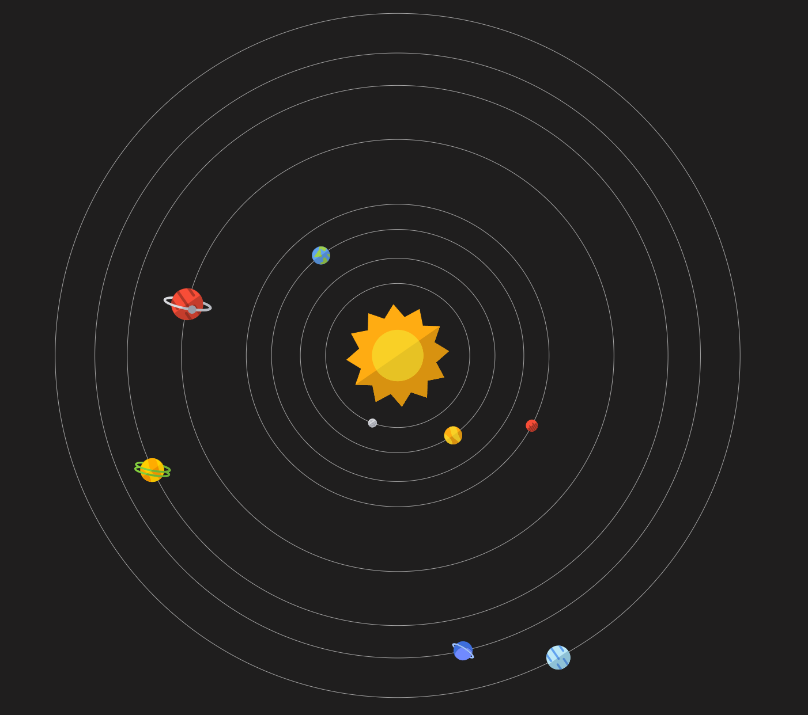

# 🪐🪐Sistema Solar en JavaScript🪐🪐

Este proyecto consiste en la implementación de un modelo simple de sistema solar utilizando el canvas de JavaScript y HTML para la representación gráfica.

## Funcionalidades

- Representación visual de los planetas en el sistema solar.
- Movimiento orbital de los planetas alrededor del sol.
- Interactividad básica para explorar el sistema solar.

## Tecnologías Utilizadas

- HTML
- CSS
- JavaScript 

## Cómo Ejecutar el Proyecto

1. Clona este repositorio:

   -en bash:
      git clone https://github.com/Barsino/Solar-System-Js.git

2. Abre el archivo index.html en tu navegador web
3. ¡Explora el sistema solar!🚀
   
   
